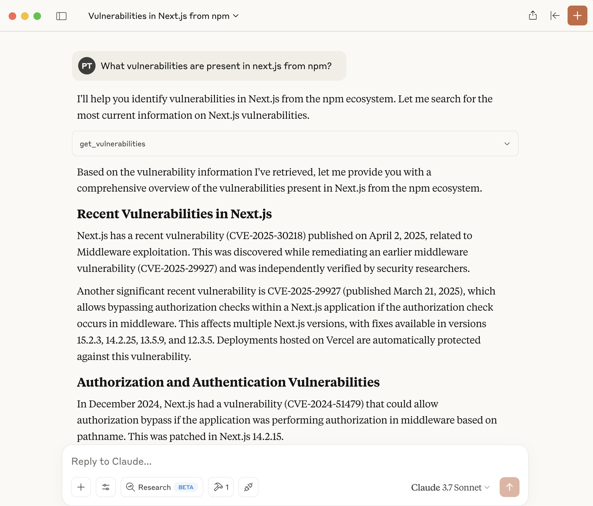

# OSV MCP Server

This project provides an MCP (Model Context Protocol) server for integrating OSV (Open Source Vulnerabilities) data and tools with AI assistants or large language models (LLMs). The server is implemented in Python and exposes tools and resources that can be used by LLMs to enhance their workflow and capabilities. Here is a screenshot of Claude Desktop using the OSV MCP Server.



## Features

- Exposes OSV-related data via the MCP protocol
- Easily connectable to AI assistants or LLMs that support MCP
- Simple Python-based setup

## Prerequisites

- **Python 3.8+** installed on your system
- **uv** (Python package manager, [installation instructions](https://github.com/astral-sh/uv))

## Setup Instructions

### 1. Clone the Repository

Clone this repository to your local machine:

```bash
git clone https://github.com/your-org/osv-mcp.git
cd osv-mcp
```

### 2. Create a Virtual Environment (Recommended)

It is recommended to use a virtual environment to avoid dependency conflicts:

```bash
curl -LsSf https://astral.sh/uv/install.sh | sh
uv venv
```

### 3. Install Dependencies

Install the required Python packages using [uv](https://github.com/astral-sh/uv):

```bash
uv sync
```

### 4. Start the MCP Server

Run the server using:

```bash
uv run vulns.py
```

## Using MCP Servers with AI Assistants and LLMs

MCP servers expose tools and resources over a local or network-accessible API. AI assistants and LLMs that support the Model Context Protocol can connect to one or more MCP servers to extend their capabilities. Once connected, the assistant can invoke the query_vulnerabilities tool.

Consult your AI assistant or LLM's documentation for specific instructions on adding or configuring MCP servers.

### Using OSV MCP Server with Claude Desktop

Add the OSV MCP server in `claude_desktop_config.json` file.

On Mac or Linux, edit: `~/Library/Application\ Support/Claude/claude_desktop_config.json`.
On Windows, edit: `env:AppData\Claude\claude_desktop_config.json`.

Add the OSV MCP server to the config as below.

```json
{
    "mcpServers": {
        "vulns": {
            "command": "uv",
            "args": [
                "--directory",
                "/ABSOLUTE/PATH/TO/PARENT/FOLDER/osv-mcp",
                "run",
                "vulns.py"
            ]
        }
    }
}
```

## Development

- Source code is in `vulns.py`.
- Project dependencies are managed via `pyproject.toml`.

## License

[MIT License](LICENSE) (or specify your license here)

---

For further questions or support, please open an issue or contact the maintainers.
